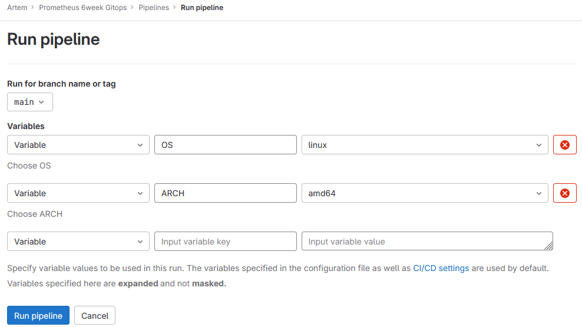

# Migrated pipeline from Jenkins to GitLab (task from Prometheus 6week Gitops)

`jenkins.groovy` is the initial pipeline that needed to be migrated to GitLab by the requirements.

`.gitlab-ci.yml` is the final migrated pipeline in `.yml` format. 

You can choose desired OS and ARCH before starting pipeline as it was in jenkins pipeline.

### GitLab and Jenkins are both popular tools used for continuous integration and continuous delivery (CI/CD) processes, but they have different features and approaches. Here are some pros and cons of each:

### **GitLab**:

#### **Pros**:

Integrated Platform: GitLab provides an all-in-one solution for version control (Git repository hosting), CI/CD pipelines, issue tracking, code reviews, and more. This integration simplifies the setup and management of the development workflow.

Built-in CI/CD: GitLab has built-in CI/CD capabilities, allowing you to define and manage CI/CD pipelines directly within the GitLab repository. This native integration makes it easy to set up and use.

GitLab Runner: GitLab provides GitLab Runner, which is the agent responsible for running CI/CD jobs. It offers various executors and deployment options, including Docker, Kubernetes, and shell.

Easy Configuration: GitLab CI/CD pipelines can be defined using a simple YAML syntax, making it easy to configure and understand the build and deployment process.

Auto DevOps: GitLab offers Auto DevOps, which is a set of predefined CI/CD templates that automatically configure pipelines for common use cases. It helps developers get started quickly.

Security Features: GitLab includes security scanning tools that can identify vulnerabilities in the codebase, container images, and dependencies.

#### **Cons**:

Limited Extensibility: While GitLab offers many built-in features, it may have limited extensibility compared to Jenkins, especially when it comes to integrations with third-party tools.

Learning Curve: Users who are more familiar with Jenkins may need some time to adapt to GitLab's CI/CD setup and configuration.

### **Jenkins**:

#### **Pros**:

Extensibility: Jenkins is highly extensible through a vast array of plugins available in the Jenkins Plugin Index. This allows users to customize and integrate Jenkins with numerous tools and services.

Large Community: Jenkins has a large and active user community, which means a wealth of resources, plugins, and support available.

Scripting Flexibility: Jenkins Pipeline allows for flexible scripting in Jenkinsfile, enabling complex CI/CD workflows and custom logic.

Frequent Updates: Jenkins is frequently updated with new features and bug fixes, making it a continuously evolving CI/CD platform.

#### **Cons**:

Plugin Management: With numerous plugins, managing plugin compatibility and updates can be challenging, and some plugins may become outdated or less maintained over time.

External Dependencies: While Jenkins has many plugins, some features require external tools and services to be integrated manually.

Separate Setup: Jenkins requires additional setup for version control hosting (e.g., GitHub, GitLab) and other features not included in the core installation.

### Ultimately, the choice between GitLab and Jenkins depends on your specific needs, preferences, and familiarity with each tool. GitLab may be more suitable for teams looking for an integrated solution with built-in CI/CD capabilities, while Jenkins offers more flexibility and extensibility for teams with complex or unique requirements.

